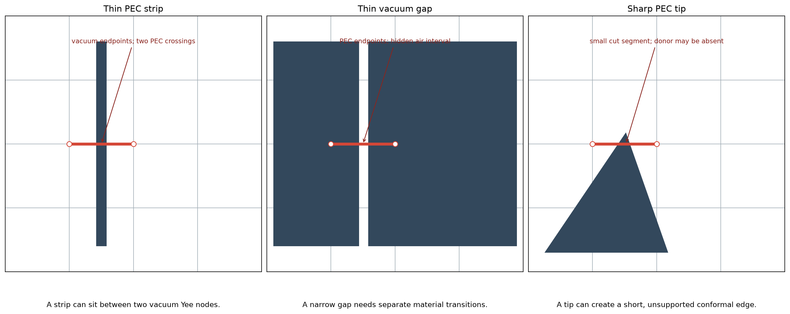
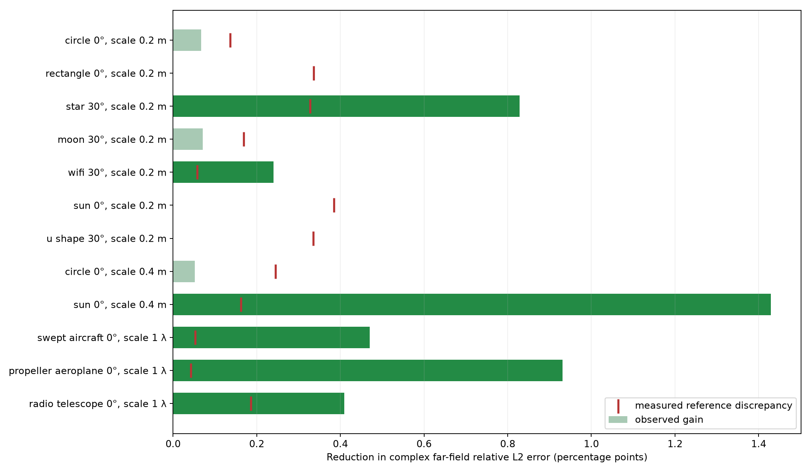
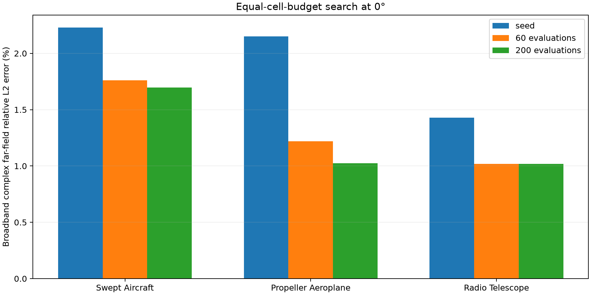
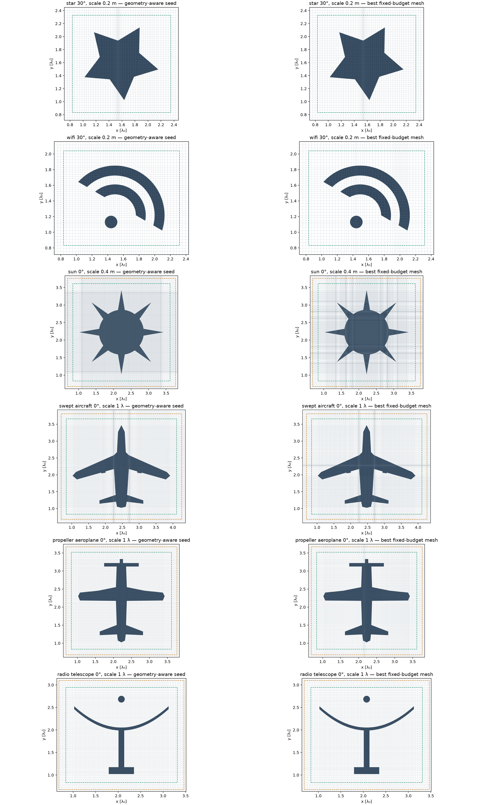
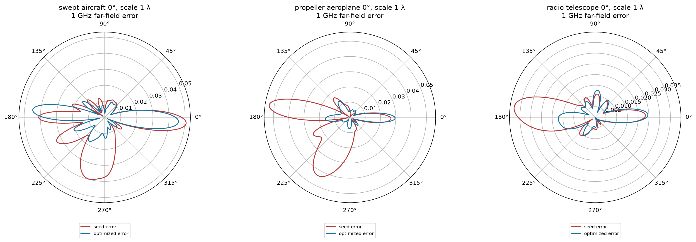
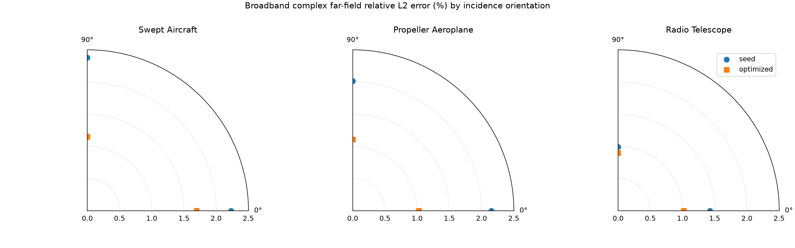
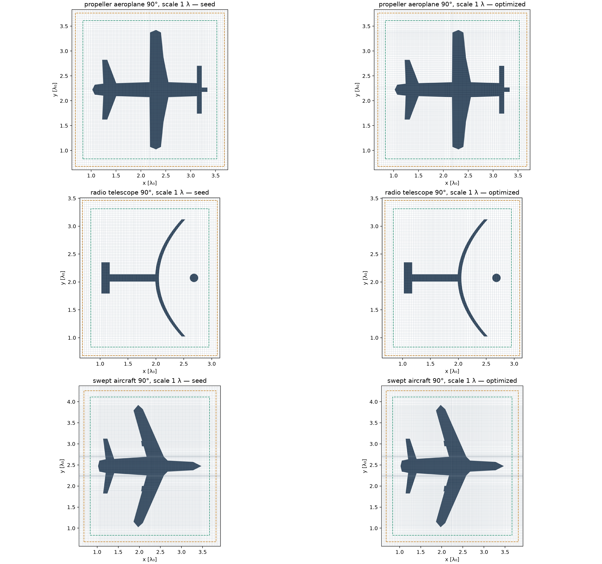
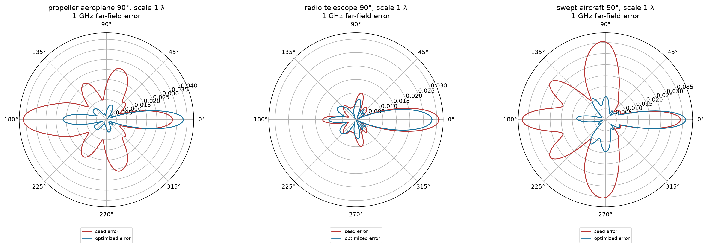
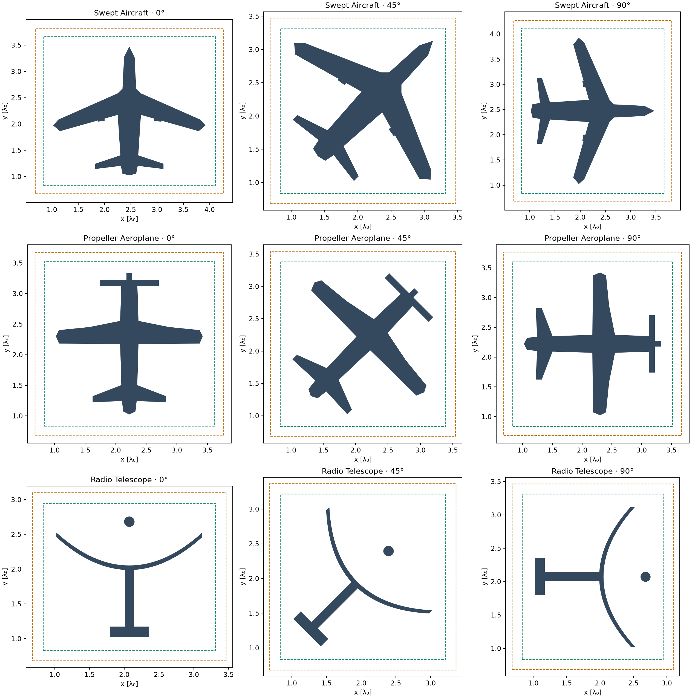

# Geometry-aware, fixed-budget meshing for conformal PEC scattering

This report studies whether a limited number of nonuniform Yee cells can be
placed more accurately around complex PEC silhouettes. It covers a working
2D GPU solver, exact-geometry-aware mesh construction, numerical-reference
qualification, fixed-budget optimization, and a constrained learning plan.
All reported far fields are **2D TMz** results; the engineered silhouettes
are stress tests, not 3D radar-cross-section predictions.

The [feasible-local optimizer follow-up](feasible_optimizer_study.md) compares
seed-relative search and geometric restoration against the density-based DE
results below, including acceptance, actual mesh variation, and matched
accepted-evaluation prefixes.

## Why conformal meshing matters

Finite-difference time-domain (FDTD) time stepping samples electric and
magnetic fields on staggered Yee locations. A Cartesian grid represents a
curved or diagonal PEC boundary poorly if cells are simply labeled wholly
metal or air: the boundary becomes a staircase. Refining only the grid
spacing cannot distinguish mesh-placement gains cleanly while this boundary
error dominates. Conformal FDTD instead uses the *continuous* geometry to
measure the open part of each magnetic edge and removes electric nodes in
PEC. The implementation here uses exact CSG scanline intersections until the
mesh and solver coefficients are built; it does not first rasterize the shape.
This is related to the conformal PEC method of
[Dey and Mittra (1997)](https://doi.org/10.1109/75.622536).

A very short open edge gives an inverse-length term of order $1/s$ in the
Faraday update. That can force an impractically small stable time step. This
solver pairs any cut edge with open length $0<s<h/2$ to an unused, complete
vacuum edge on its air side. It borrows $b=h/2-s$, forming an effective
length $S=s+b$; the coupled two-edge operator preserves the combined
integral and remains symmetric positive. The time step is selected from the
prepared operator's spectral bound. This is an enlarged-cell approach in the
spirit of [Xiao and Liu (2008)](https://doi.org/10.1109/TAP.2008.916876) and
the stability discussion of
[Zagorodnov et al. (2007)](https://www.sciencedirect.com/science/article/pii/S0021999107000642).
The paper algorithms and this implementation are not identical.

For the small edge $s$, full donor $d$, borrowed length $b$, and
$r=b/d$, the coupled inverse-length update uses
$$
g_s=\frac{f_s+r f_d}{s+b},\qquad
g_d=r g_s+\frac{1-r}{d}f_d,
\qquad s g_s+d g_d=f_s+f_d.
$$
Here $f_s,f_d$ are the two edge differences and $g_s,g_d$ are their
coupled conformal gradients. The final identity states conservation over
the paired edges; the solver also checks that the donor is complete, unused,
and large enough. A boundary intersection alone is therefore insufficient
to declare a mesh conformally usable.



The schematic highlights why a visually fine grid can still be unusable:

- A thin PEC strip can enter and leave one Yee edge while *both endpoints are
  air*. Endpoint material labels then miss two crossings and would erase the
  strip from the edge equation.
- A thin vacuum gap can cross an edge whose endpoints are *both PEC*, hiding
  the connected air opening. In addition, two close cut faces can compete for
  the same full-air donor, so the enlarged-cell operator cannot be formed.
- A sharp tip can place several PEC/air transitions in one edge or leave a
  sliver open face without a donor. Forcing a formal coefficient on that grid
  would change topology or compromise the stable update.

Touching PEC primitives form one conductor in the ordered CSG geometry; an
internal contact is not an air slit. At a tangent contact or a narrowing
gap, however, the local feature width tends toward zero. No fixed Cartesian
cell budget can resolve every nearby cross-section exactly. The mesh builder
therefore reports the unresolved edge and its resource cap instead of
silently changing whether the conductors touch. This distinction is central
when creating training labels: a model must not learn from a solution whose
grid has accidentally opened or closed a gap.

The solver rejects these cases. A rejected trial is a **representation or
construction failure**, not a scattering accuracy measurement or evidence
that the geometry itself is physically invalid.

## Geometry-aware construction and fixed-budget search

The simulation domain is derived from the continuous geometry, leaving a
fixed five-cell scatterer-to-TF/SF margin, four cells to the near-field
integration contour, six cells to the PML interface, and 12 PML cells. For
each candidate grid, the constructor intersects the exact ordered PEC/air CSG
recipe with every Yee edge. It detects hidden transitions and missing donors,
places new x or y witness lines at the offending intervals, then solves for
valid nonuniform axis positions under spacing constraints. Repair repeats
until the actual conformal enlarged-cell operator accepts the grid or an
explicit time, pass, or cell cap is reached. Fixed exterior coordinates keep
the TF/SF and absorbing region comparable across coarse candidates. A
tensor-product grid means each inserted x or y line spans the domain; this is
efficient for the current solver but costly for local geometric detail.
The corresponding source is the
[geometry-aware constructor](../src/fdtdmesh/geometry_mesher.py) and the
[conformal operator](../src/fdtdmesh/solver/conformal.py).

The optimizer starts **after** one valid mesh is found. It keeps the number of
x and y cells, the fixed exterior, and the exact geometry witness anchors.
Differential evolution changes six positive log-density controls per axis;
interpolation produces a 1D density for each axis, and a constrained
projection allocates the same cell count. The strict solver preparation is
the final feasibility test. Feasible candidates receive a GPU solve and the
broadband complex far-field error against a qualified fine reference; invalid
ones receive a penalty. A 200-evaluation run is an empirical search budget,
not a guarantee of a global optimum.
The [optimizer implementation](../src/fdtdmesh/benchmarks/optimize.py)
records every feasibility outcome and candidate error.

## Finding

There is useful optimization headroom after a valid geometry-aware mesh has been
constructed. In this study, a 60-evaluation density search reduced the complex
far-field error beyond the measured fine-reference discrepancy for a rotated
star, a Wi-Fi symbol, a larger sun, and three engineered silhouettes. The gain
is strongly geometry dependent. The same search gave no resolved gain for two
circles, a rectangle, a moon, a small sun, or a U-shape. The small sun and U-shape
also rejected nearly all proposals, so their result says more about the search
parameterization than about the best possible mesh.

Extending the three 0° engineered searches to **200 evaluations** improved
the swept aircraft from 1.760% to 1.695% error and the propeller aeroplane
from 1.219% to 1.024%; the radio telescope remained at 1.018%. These are
independent fixed-budget runs with the same optimizer seed, not a claim that
every shape benefits from a longer search. Their selected meshes all passed
the tighter stopping validation.

At 90°, the 200-evaluation search cut swept-aircraft error from 2.383% to
1.150% and propeller-aeroplane error from 2.015% to 1.106%. Both gains are
well above their measured reference discrepancies. The telescope fell from
0.991% to 0.900%, but that gain is below its 0.220-percentage-point
discrepancy and is unresolved. Thus **five of the six** engineered 200-trial
cases show a gain larger than the present reference-discrepancy indicator.

The geometry-aware constructor produced a strictly usable mesh in 44 of 48
catalogue shape/orientation/scale cases. Among those 44 valid geometry-aware
cases, a generic uniform grid at the same cell counts was usable in only 34.
This is a feasibility result, separate from the accuracy gains below.



## Numerical setup

The model is **2D TMz scattering from PEC in air**, with a +x incident plane
wave, a Gaussian broadband pulse from 0.9 to 1.1 GHz, 21 DFT frequencies, and
360 observation angles. Lengths in the solver are SI metres. The source,
time-stepping, current DFT, convergence check and near-to-far-field calculation
run through the native CUDA solver in float64. The exact geometry remains a
continuous CSG recipe until meshing. A 30° incidence case is represented by
rotating that recipe relative to the fixed +x source; both reference and coarse
solutions use the same rotated geometry and angle coordinates.

The automatically generated domain uses 12 PML cells, six cells from the PML
interface to the integration contour, four from the contour to the TF/SF box,
and five from the scatterer to the TF/SF box. These policy lengths and all
exterior-axis coordinates stay fixed across coarse candidate meshes within a
case. This controls the boundary and source geometry when comparing meshes.
The fine-grid references intentionally refine their exterior as part of their
convergence study.

All candidates pass the solver's actual preparation step, including PEC/air
edge intersection and enlarged-cell donor checks. An invalid candidate is
recorded as a failed trial and never receives a far-field accuracy score.
The density search uses six controls per axis, differential evolution with
population 12 and seed 0. Catalogue cases use 60 evaluations; the 0°
engineered cases have both 60- and 200-evaluation runs. Each count includes
the geometry-aware, uniform, and deterministic baselines, leaving at most 57
or 197 search proposals. Every candidate has the same `(Nx, Ny)` as its
geometry-aware seed, preserves that seed's exact repair witness anchors, and
uses the same domain, frequency vector, material, TF/SF box, contour and PML.
The search changes only interior axis spacing. The stored per-trial archives
also record rejected conformal geometries and projection timeouts.

For each frequency, error is the angular complex-field relative L2 difference
from the qualified fine reference. The table reports the RMS of this error
over the 21 frequencies. Complex fields retain phase; this is stricter than a
comparison of scattering-width magnitudes alone. A tighter device stopping
run of each selected best mesh passed the reference tolerance.

Writing $F_m(f,\theta)$ for a candidate's complex far field and $F_r$ for
the reference, the objective is
$$
E=\left[\frac{1}{N_f}\sum_f
\left(\frac{\|F_m(f,\cdot)-F_r(f,\cdot)\|_2}
{\max(\|F_r(f,\cdot)\|_2,10^{-12}\sqrt{N_\theta})}\right)^2
\right]^{1/2}.
$$
All candidates in one optimization use the same physical geometry, source,
frequency and observation-angle samples, TF/SF and contour positions,
absorber, and exact-conformal solver.

The ordinary reference protocol uses uniform-target, exact-corner-aligned
grids. Qualification requires two successive spatial differences below 0.5%
in both RMS and worst-frequency metrics, plus separate checks with tenfold
tighter stopping thresholds, expanded PML and a displaced near-field contour.
The telescope's 33-segment dish prevents that exact-anchor projector from
producing a fine grid. Its 0° reference instead subdivides every interval of
its already-valid geometry-aware grid by factors 2, 3, 4 and 5, while refining
the PML cell count. Factors 3→4 and 4→5 pass the same spatial tolerance;
the same temporal, PML and contour checks pass. This preserves strict
conformal validity and gives a qualified **numerical** reference, though its
refinement family differs from the other cases.

The “reference discrepancy” below is the largest observed RMS difference
among the last two spatial comparisons and the temporal/PML/contour checks.
It is an empirical resolution indicator, **not a rigorous error bound**. A
gain smaller than this difference is unresolved by the present study. A gain
larger than it is evidence for useful headroom, not proof of global optimality
or of the exact continuum error.

## Equal-cell-budget GPU results

Catalogue `scale` is in **metres**. Engineered `scale` multiplies the free-space
wavelength at 1 GHz. Errors and discrepancies are percent; gain is the
percentage-point reduction relative to the geometry-aware seed. “Valid” counts
search proposals only, excluding the three baselines: 57 possible for the
60-evaluation catalogue cases and 197 for the 200-evaluation engineered cases.
All 12 references were qualified and all 12 selected meshes passed tighter
stopping validation.

| Shape, angle, scale | Cells | Valid | Seed error | Best error | Gain | Reference discrepancy |
|---|---:|---:|---:|---:|---:|---:|
| Circle, 0°, 0.2 m | 85×85 | 57/57 | 0.685% | 0.619% | 0.067 pp | 0.137 pp |
| Rectangle, 0°, 0.2 m | 90×78 | 57/57 | 1.161% | 1.161% | 0 | 0.336 pp |
| Star, 30°, 0.2 m | 94×94 | 39/57 | 3.202% | 2.374% | 0.828 pp | 0.328 pp |
| Moon, 30°, 0.2 m | 86×94 | 35/57 | 0.758% | 0.687% | 0.071 pp | 0.169 pp |
| Wi-Fi, 30°, 0.2 m | 93×84 | 12/57 | 1.961% | 1.721% | 0.240 pp | 0.057 pp |
| Sun, 0°, 0.2 m | 97×97 | 2/57 | 5.779% | 5.779% | 0 | 0.385 pp |
| U-shape, 30°, 0.2 m | 111×111 | 3/57 | 1.003% | 1.003% | 0 | 0.335 pp |
| Circle, 0°, 0.4 m | 116×116 | 57/57 | 0.787% | 0.735% | 0.052 pp | 0.245 pp |
| Sun, 0°, 0.4 m | 232×232 | 4/57 | 2.933% | 1.504% | 1.429 pp | 0.162 pp |
| Swept aircraft, 0°, 1λ | 178×159 | 74/197 | 2.230% | 1.695% | 0.534 pp | 0.053 pp |
| Propeller aeroplane, 0°, 1λ | 139×136 | 152/197 | 2.151% | 1.024% | 1.127 pp | 0.042 pp |
| Radio telescope, 0°, 1λ | 128×116 | 192/197 | 1.428% | 1.018% | 0.409 pp | 0.186 pp |



The aircraft and aeroplane had measurable additional headroom at 200 trials.
The telescope's 200-trial search did not beat its 60-trial best, despite a high
valid-proposal fraction. The plotted runs use the same seed and physical case,
but their optimizer archives are separate; they are not a paired statistical
estimate across random seeds.

The deterministic baseline, scored at the same cell budget, is already better
than the geometry-aware seed for the moon, Wi-Fi and telescope. The winning
search mesh still beats that stronger baseline for Wi-Fi by 0.102 pp and for
the telescope by 0.211 pp. The telescope advantage over deterministic is only
slightly above its measured 0.186 pp reference discrepancy; it merits an
additional independent fine reference before using it as a training label.
For the moon, the gain over deterministic is below the discrepancy.



The 1 GHz polar panels below show the *magnitude of complex far-field error*
versus observation angle, normalized by the reference field's angular RMS
magnitude. They show where each engineered mesh gained or lost angular
accuracy; the aggregate table is the broadband objective and does not imply
every angle improved.



## Rotated-incidence accuracy study

All three 90° engineered cases have qualified numerical references and
completed 200-evaluation searches. The angle denotes the silhouette's
rotation relative to the fixed +x incident plane wave; it is the **relative
incidence orientation**, not a rotation of the far-field axes. Counts below
exclude the three baseline trials. As at 0°, each seed and its optimized
mesh use exactly the same x/y cell counts and physical setup.

| Shape at 90° | Cells | Valid search trials | Seed error | Best error | Gain | Reference discrepancy |
|---|---:|---:|---:|---:|---:|---:|
| Swept aircraft | 159×178 | 57/197 | 2.383% | 1.150% | 1.234 pp | 0.040 pp |
| Propeller aeroplane | 136×139 | 166/197 | 2.015% | 1.106% | 0.909 pp | 0.036 pp |
| Radio telescope | 116×128 | 194/197 | 0.991% | 0.900% | 0.091 pp | 0.220 pp |

The aircraft and aeroplane gains exceed their observed reference
discrepancies by a wide margin. The telescope gain does not, so the present
reference study **cannot resolve** whether that 90° mesh is genuinely more
accurate. All three selected meshes passed tighter stopping validation. The
90° seed errors should not be compared directly with the 0° seed errors as
if they were estimates of one physical problem: incidence orientation changes
the scattering field.



The polar markers give the broadband complex-field error for tested 0° and
90° incidence orientations only; no intermediate accuracy curve is implied.
The panels below show the exact PEC and the seed/selected Yee meshes at 90°,
followed by the angular error in the 1 GHz complex far field. Angular error
may rise at some observation directions even when its broadband aggregate
falls.





Across the study there are **18 optimization runs**: 12 original
60-evaluation cases and six engineered 200-evaluation cases, for 1,920
trial records including baselines. This is one differential-evolution seed
per configuration; the numerical gains are controlled within each case but
do not establish optimizer-to-optimizer statistical variability.

## Engineered shapes and feasibility limits

The swept aircraft is a swept-wing/nacelle/tail top-view planform; the
propeller aeroplane is a straight-wing top-view planform with a broad PEC
propeller; the radio telescope is a 33-segment parabolic-dish side view with
a PEC mount and feed. The default feed support is electrically transparent;
explicit thin PEC struts proved much harder to mesh under this policy. These
are exact **2D polygon/CSG silhouettes** passed to the solver, then implicitly
extruded along z by TMz. They are useful geometry stress cases, **not 3D
aircraft or telescope radar cross-section predictions**. The dish polygon
approximates a parabola rather than representing an analytic curved surface.
The exact construction recipes are in the
[engineered-shape module](../src/fdtdmesh/benchmarks/engineered_shapes.py).



The source remains a +x incident plane wave. Rotating the exact silhouette
relative to that source changes the physical incidence orientation without
rotating the source or the observation-angle coordinate system. Each angle
uses a newly fitted automatic domain and its own qualified reference before
any cross-mesh accuracy comparison.

Of 12 engineered combinations (three silhouettes × 0°/30° × 0.5λ/1λ),
seven produced valid strict-conformal geometry-aware grids within the
512×512/20-pass construction caps. All three 0°/1λ cases above ran the full
GPU reference and optimization study. The swept aircraft and propeller
aeroplane at 30° exhausted repair passes or the cell cap. The 30°/1λ
telescope did produce a valid 173×176 coarse grid, but its standard
exact-anchor reference had no valid fine level. A second, geometry-aware
fine-grid attempt converged at 40, 64 and 96 target points per wavelength;
its 40→64 change was 0.569%, above the 0.5% criterion, while 64→96 was
0.200%. Attempts at 112 and 128 target points per wavelength reached the
1024-axis-cell cap. There is therefore **no qualified 30° telescope accuracy
comparison**. We retain that result as an explicit reference-generation
limitation rather than treating the 96-grid field as ground truth.

A second orientation screen widened the construction cap to 768 cells per
axis and 30 repair passes, trying 24, 32, 40 and 64 target points per
wavelength with a 15-second limit per attempt. It found a strict-conformal
seed for **13 of 15** additional 1λ cases: each silhouette at 15°, 30°,
45°, 60° and 90°, except the propeller aeroplane at 30° and 60°. The latter
are *construction timeouts under these settings*, not impossibility proofs.
The rotated seed counts ranged from 116×128 to 426×413; therefore equal-cell
accuracy claims must be made **within each angle**, not between these
different budgets. Reference qualification and optimization are separate
from this CPU-only feasibility screen.

At 90°, the aircraft and aeroplane qualified uniform-target references after
valid 196, 256 and 320 points-per-wavelength levels; lower attempted levels
often could not meet the exact-anchor projection constraints. The 90°
telescope required nested subdivisions of its valid geometry-aware seed by
factors 2, 3 and 4, followed by the same stopping/PML/contour checks. An
attempted 15° telescope subdivision passed the 3→4 comparison but not 2→3;
factors 5–7 were rejected by the strict conformal operator. Aircraft 45°
subdivisions 2–7 were likewise rejected. These oblique cases remain useful
feasibility tests but have **no qualified accuracy comparison** in this report.

For a further topology stress test, perforated PEC plates with 3×3, 5×5,
7×7 and 9×9 circular air holes were screened at 0° and 22.5°. Six of eight
obtained valid strict-conformal meshes; the 7×7 and 9×9 rotated versions hit
the 45-second projection cap. The 0° 9×9 case has 82 geometry primitives
and a valid 155×155 grid. These are feasibility screens only, not far-field
accuracy claims. A construction cap or timeout does not establish that no
valid mesh exists.

## Implication for a future learned mesher

The data support continuing mesh optimization for strict-conformal PEC
scattering. Large gains on the star, larger sun and two aircraft silhouettes
show that geometry awareness alone does not exhaust the fixed-budget accuracy
potential. The telescope result is promising but less decisive relative to its
strongest simple baseline. Feasibility is the immediate bottleneck for sharp
tips and dense CSG: only 2/57 small-sun proposals, 3/57 U-shape proposals,
4/57 large-sun proposals and 74/197 swept-aircraft proposals survived actual
conformal preparation. A CNN trained on arbitrary density vectors would waste
many outputs in the same invalid region. A next optimizer should encode
intersection/donor constraints directly or propose local changes around a
validated grid, then keep the strict solver validator as the final authority.
The failed direct-coordinate warp screen is recorded separately in the raw
study artifacts; all 168 sampled warps violated the present adjacent-ratio
constraint. That rules out that naive parameterization, not local mesh
optimization in general.

## Proposal: learn feasible, budgeted mesh placement

The first learned model should predict **axis spacing**, not a 2D material
image or a complete solver grid. The present solver's meshes are tensor
products of two 1D coordinate arrays. A compact residual U-Net can encode a
multiscale rasterization of the *exact* geometry (PEC occupancy, signed
distance to the PEC boundary, local feature width, corner/transition maps),
together with incidence angle, frequency band, target cell counts and the
geometry-aware seed. Two 1D heads then predict corrections to positive x/y
mesh densities. This adapts the multiscale design of
[U-Net](https://arxiv.org/abs/1505.04597) with residual blocks from
[ResNet](https://arxiv.org/abs/1512.03385). A much smaller pair of 1D
convolutional models should be the first baseline: if it matches the ResU
model, the 2D encoder is unnecessary. Because the geometry itself is kept
exact in the simulation, raster channels are only model inputs; they are
never substituted for the actual PEC boundary during meshing.

The output goes through a constrained projector that **exactly fixes the
cell budget, exterior lines and required witness anchors**, followed by the
same strict conformal/enlarged-cell validator used in this report. The neural
network cannot guarantee feasibility by itself. Training can use high-quality
search archives as demonstrations, but should retain *all* feasible
candidates and their measured errors rather than regress to one arbitrary
best grid: multiple distinct grids may have indistinguishable error. A
ranking or error-surrogate head can refine a small shortlist after
projection. Invalid trials are useful feasibility labels; near-feasible
trials can guide repairs.

The current study is **too small to train or validate** such a model. A
server-scale dataset should sample held-out geometry families, scales,
rotations, incidence angles and several cell budgets. For each case, obtain
a qualified reference, run multiple search seeds up to 200 evaluations (or
more when the gain is still changing), and save complete descriptions,
candidate axes, failure reasons and complex-field metrics in reproducible
archives. Split test sets by geometry family, not merely random rotations of
the same base silhouette. Report strict-conformal success rate, fixed-budget
error reduction relative to the geometry-aware and deterministic baselines,
gain relative to measured reference discrepancy, inference/projection time,
and total GPU solves. An independent finer reference should adjudicate gains
near the discrepancy. The useful ML target is fewer expensive solves for a
reliably better valid mesh, rather than imitation of one optimizer trace.

The committed [machine-readable results](geometry_aware_optimization_results.json)
contain every feasibility screen, reference level/check and aggregate search
result. The scripts in [`examples/geometry_optimization_study`](../examples/geometry_optimization_study)
recreate the screens, GPU references, 60/200-evaluation comparisons and figures. From
the repository root, for example:

```powershell
.venv/Scripts/python examples/geometry_optimization_study/probe.py
.venv/Scripts/python examples/geometry_optimization_study/engineered_probe.py
.venv/Scripts/python examples/geometry_optimization_study/engineered_angle_screen.py
.venv/Scripts/python examples/geometry_optimization_study/perforated_probe.py
.venv/Scripts/python examples/geometry_optimization_study/reference_case.py swept_aircraft 0 1
.venv/Scripts/python examples/geometry_optimization_study/subdivision_reference.py 0 1
.venv/Scripts/python examples/geometry_optimization_study/optimize_case.py swept_aircraft 0 1 200
.venv/Scripts/python examples/geometry_optimization_study/plot_engineered_angles.py
.venv/Scripts/python examples/geometry_optimization_study/illustrate_challenges.py
.venv/Scripts/python examples/geometry_optimization_study/build_report.py
```

Run `reference_case.py` and `optimize_case.py` with each catalogue/engineered
case in the table. The engineered-shape optimizer defaults to 200 evaluations;
the fourth CLI argument can select any budget from 3 to 200. Use
`subdivision_reference.py <angle> 1 radio_telescope` when the ordinary
exact-corner reference cannot qualify the telescope. A reference must be
qualified before `optimize_case.py` will launch search trials.
HDF5 results and full per-trial traces are cached in `artifacts/`, keyed by
the complete simulation and optimizer descriptions. The committed JSON and
figures are the compact evidence record; the HDF5 caches remain local.
