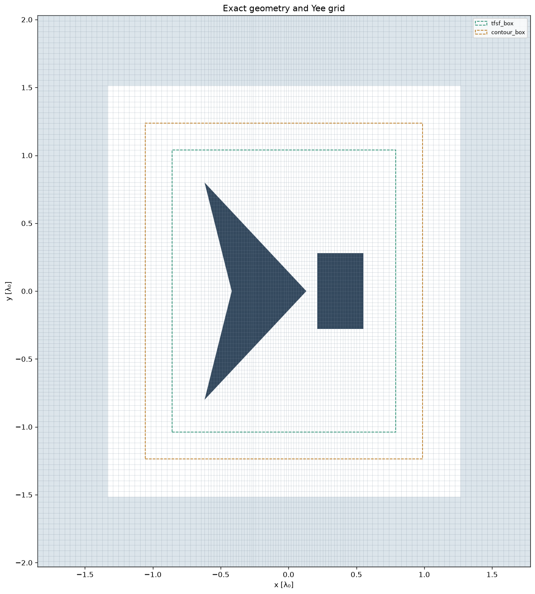
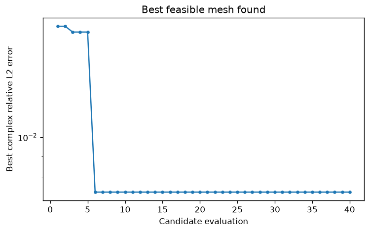

# Hybrid tip optimization

Notebook [05](../notebooks/05_hybrid_tip_optimization.ipynb) tests a sharp concave polygon beside a block and a seven-point star. It prepares both at 0° and 30°, with editable lists of cell budgets. Geometry is exact throughout; only the discrete boundary treatment uses local staircase fallback.

## Method

Geometry-aware preparation makes a bounded number of topology repairs, retains the accepted mesh with the smallest maximum physical fallback-patch diameter (then total patch area), and stops when repairs cease improving it. This is a resource limit, not proof that every possible grid would need fallback. The cell budget is never increased during a fixed-budget search.

`optimize_mesh` now defaults to hybrid boundary treatment. The feasible-local optimizer moves grid lines and minimizes complex far-field error against a qualified reference. It may accept more fallback cells if the resulting field is more accurate. An explicit `boundary=BoundaryPolicy(mode="conformal")` requests strict search.

`DomainPolicy(margin_mesh="graded")` allows lines between the scatterer bounds and TFSF to move while preserving their count and the physical margin. Exterior axis coordinates remain fixed during optimization. This avoids pinning the cell width immediately outside bounding-box tips. Full-domain subdivision, including the exterior, is used for reference qualification.

Hybrid references additionally check that nonzero fallback patches shrink in both total physical area and maximum bounding-box diameter. These diagnostics are not electromagnetic error bounds: even a small patch can alter an important gap or connection. Spatial, temporal, PML, and contour comparisons remain necessary.

## Measured GPU results — 29 September 2026

Native CUDA runs used three DFT bins, 40 evaluations per search, and the notebook's default reference tolerances: 0.2% RMS complex far-field difference and 0.5% worst-frequency difference. The following measurements are for **0° only**. CPU geometry preparation and plots were also checked at 30°; GPU optimization at 30° remains available through the notebook.

| Shape | Total cell budget | Geometry-aware seed error | Best error | Accepted search proposals | Winner fallback cells |
|---|---:|---:|---:|---:|---:|
| Tip and block | 120 × 120 | 1.845% | 0.738% | 37 / 37 | 4 |
| Tip and block | 160 × 160 | 1.458% | 0.792% | 37 / 37 | 8 |

Each search also evaluated three baselines, giving 40 evaluations in total. All 37 local proposals were valid before repair and produced unique solved meshes. Both winners passed the tighter temporal stopping check.

The tip-and-block reference qualified using subdivision factors 2, 3, 4, and 6 of its independent 120 × 120 seed, ending at 720 × 720. The largest difference used in the reference report was 0.176%; this is an observed sensitivity, not a rigorous uncertainty bound. Its prepared reference meshes happened to require no fallback, whereas both optimized winners used hybrid cells.

The 160 × 160 search did not beat the 120 × 120 search. These are independent, bounded searches, not globally optimal meshes; their 0.054 percentage-point difference is also smaller than the observed reference sensitivity.

The **star reference did not qualify**. Full-domain subdivision reached 960 × 960, but the final 720 → 960 comparison still changed by 1.126% RMS (1.183% worst frequency). Optimization was therefore skipped. The tolerance was not relaxed. This case demonstrates that accepting a hybrid mesh and reaching temporal convergence do not establish spatial accuracy.

The portable numerical summary is [hybrid_tip_optimization_results.json](hybrid_tip_optimization_results.json). Local HDF5 runs and full search archives are written under `artifacts/notebooks/hybrid_tip_optimization/`. The earlier [uniform tip refinement study](hybrid_tip_refinement.md) provides complementary evidence about persistent tip topology.

## Running the experiment

Open notebook 05, inspect the large CPU geometry/fallback plots, then set `RUN_GPU=True`. Edit `CASES`, `ORIENTATIONS`, and `BUDGETS` to select experiments, and raise `MAX_EVALUATIONS` from 40 to 200 for a longer search. Failed reference qualification remains an explicit gate. The notebook saves best meshes, search histories, and polar far-field comparisons for every completed budget.

All 131 tests passed, including native CUDA checks. The notebook's CPU branches and its qualified reference/search/plot branches were executed; the latter reused the completed measurements above. See the [optimization API](mesh_optimization_api.md) and [mesh strategies](mesh_strategy.md) for argument tables and policy details.
