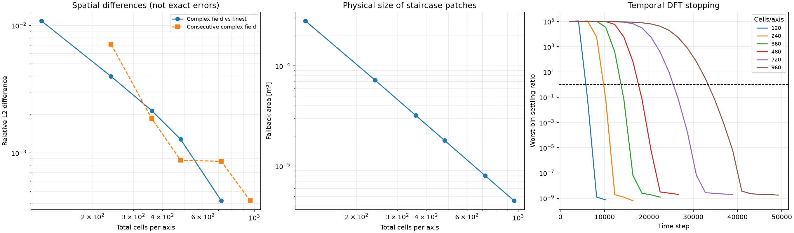
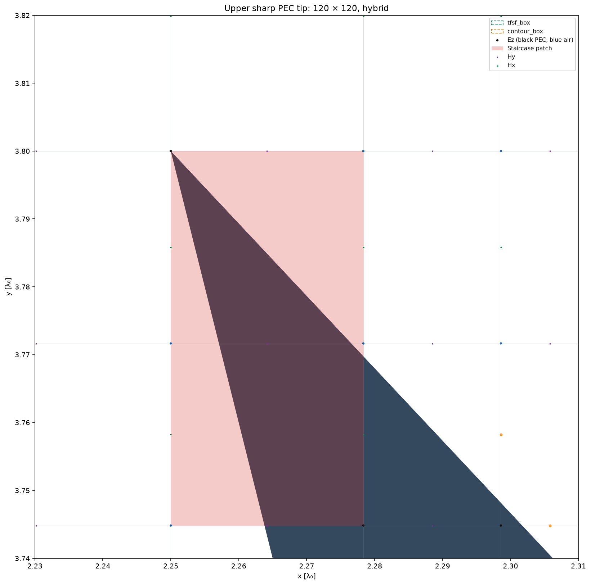
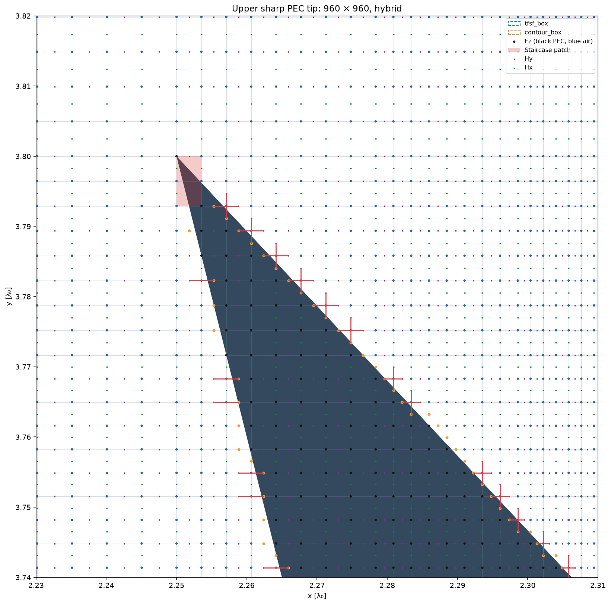
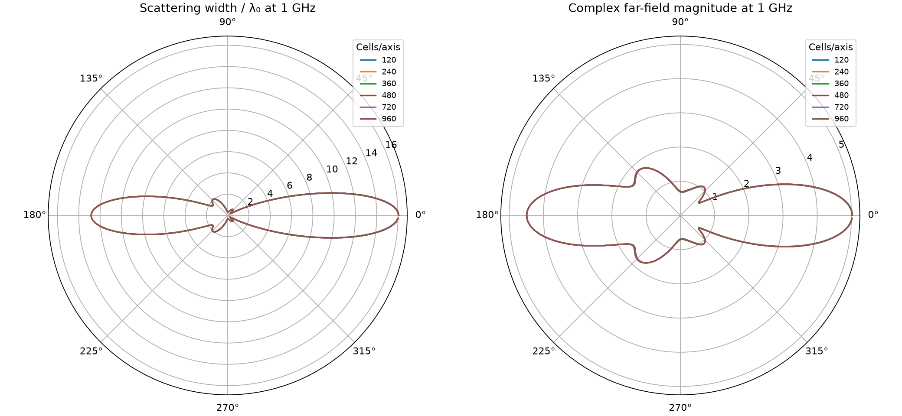

# Notebook 3: does the sharp PEC tip converge?

**The measured far field shows a decreasing refinement trend when every cell is
subdivided, including cells near the tips and in the exterior.** All six hybrid
simulations reached their temporal stopping criteria. The last complex-field
change, from 720 × 720 to 960 × 960, was **0.0421%**. Four fallback cells remained,
but their total physical area decreased by about 62 times from the coarsest mesh.

Simply increasing the notebook's `quasi_uniform` budget with the exterior fixed
gave a different, misleadingly reassuring trend. The tip patches stopped
shrinking. This distinction matters more than the raw total cell count.

## Setup

Measurements were made on 2026-09-29 with an RTX 4070 Laptop GPU, using native
CUDA field updates, DFT accumulation and NF2FF. The exact notebook geometry was
retained. With `λ0 = C0 / 1e9`, polygon vertices in wavelength units were
`[(2.25, 2.2), (3.0, 3.0), (2.25, 3.8), (2.45, 3.0)]`; the PEC block occupied
`x=[3.08, 3.42]`, `y=[2.72, 3.28]`. No tip rounding, geometry inflation or material
editing was used. The fallback patches occur near the **upper and lower left
tips**, not the right-facing vertex beside the block.

| Control | Value |
|---|---|
| Incident propagation | +x, matching the notebook |
| Source band | 0.95–1.05 GHz |
| DFT frequencies | 0.95, 1.00, 1.05 GHz; expanded from the notebook's single centre bin |
| Observation angles | 360 samples, 0° through 359° |
| Precision / Courant factor | float64 / 0.9 |
| Boundary policy | Hybrid, conformal enlarged cells outside staircase patches |
| Normal stopping | `rtol=1e-5`, `atol=1e-8`, `field_tol=1e-5`, three stable checks |
| Check interval / safety cap | 2,048 / 200,000 time steps |
| Seed | 120 × 120 quasi-uniform mesh, default wavelength-based domain policy |

The comparison uses the **complex** far field without phase or amplitude fitting.
For each frequency, compute the angular relative L2 difference; combine the three
ratios by RMS. Consecutive differences below use the preceding coarser result in
the denominator. These are numerical differences, not errors against an exact
solution.

## Refining every cell

Each original interval was divided into 1, 2, 3, 4, 6 or 8 equal pieces. Physical
geometry, domain boundaries, TFSF, contour, PML thickness and phase origin were
held fixed. PML cell counts increased with the subdivision factor. The boundary
operator and stable timestep were rebuilt at every level. Unlike the normal
fixed-exterior optimization policy, this study deliberately refines the exterior
as well, so the maximum grid spacing tends down throughout the domain.

| Total cells | Time steps to convergence | Difference from preceding mesh | Difference from 960² | Total fallback area |
|---|---:|---:|---:|---:|
| 120 × 120 | 10,240 | — | 1.0841% | 281.103 mm² |
| 240 × 240 | 16,384 | 0.7108% | 0.3979% | 72.208 mm² |
| 360 × 360 | 22,528 | 0.1857% | 0.2147% | 32.092 mm² |
| 480 × 480 | 26,624 | 0.0875% | 0.1278% | 18.052 mm² |
| 720 × 720 | 38,912 | 0.0858% | 0.0421% | 8.023 mm² |
| 960 × 960 | 49,152 | 0.0421% | — | 4.513 mm² |

Every level had four fallback cells. Their **area**, rather than their count,
reveals the refinement. For the last step the worst individual frequency changed
by 0.0440%, and the frequency-balanced scattering-width difference was 0.0237%.



The DFT curves show time convergence separately from the spatial comparisons.
The sequence is not a claim of a measured formal convergence order; ratios of
successive cell sizes differ, and the mixed operator and timestep both change.

| Upper tip at 120² | Same physical window at 960² |
|---|---|
|  |  |

Dark fill is the exact PEC. Red shading marks fallback cells; orange points and
red connecting segments show conformal cuts and enlarged-cell pairs. The exact
tip remains sharp at both resolutions.



## Why increasing only the budget was misleading

The original workflow regenerates a quasi-uniform mesh for each budget while
keeping exterior spacing and the scatterer margin axes fixed:

| Fixed-exterior budget | Consecutive complex difference | Fallback area | Difference from full-refinement 960² |
|---|---:|---:|---:|
| 120 × 120 | — | 281.103 mm² | 1.0841% |
| 180 × 180 | 0.2402% | 247.570 mm² | 1.2165% |
| 260 × 260 | 0.0246% | 247.570 mm² | 1.2062% |

The final two meshes look close to each other, but remain about 1.2% from the
fully refined result. This comparison does not isolate tip error from exterior
dispersion/PML errors; it demonstrates that small consecutive differences along
this budget sequence do not establish convergence to the fully refined result.

The sharp tips lie on the final PEC bounding box. Uniform margin cells terminate
there, and the mandatory adjacent-width ratio is at most 1.4. Thus a first
interior width beside a fixed margin width `h_ext` cannot be smaller than
`h_ext / 1.4`. Increasing the interior budget cannot remove that local resolution
floor. In these preparations, the fallback areas at 180 and 260 were identical.

Meanwhile some other cells became much smaller: the timestep fell from
`1.15e-11 s` at 120 to `5.09e-13 s` at 260. A 380 × 380 budget attempt was rejected
because the 200,000-step safety cap ended before the source/propagation guard.
That was a preparation/resource-limit rejection, **not a time-domain instability**.
The study switched to actual cell subdivision rather than increasing that cap.

## Temporal control and limits of the conclusion

The 960² case was repeated with tolerances ten times tighter and **six** stable
checks. It ran 55,296 steps instead of 49,152. Its complex far field changed by
only **1.80e-14 relative**. The last 0.0421% refinement difference therefore was
not caused by ending this simulation too early. Ordinary solves reported zero
debug field downloads and zero field transfers during stepping.

This is evidence of far-field convergence for this geometry, incidence and
frequency band. It does not establish pointwise field convergence at the PEC
corner, general hybrid accuracy, or a rigorous error bound. The 960² run is not
qualified ground truth: this study did not independently vary PML thickness,
contour position or domain clearance, and it has no analytical or independently
qualified strict-conformal reference.

For reference refinement, shrink cells near the tips **and** refine the exterior.
For fixed-exterior optimization comparisons, keep the fair exterior policy but
recognize its resolution floor; increasing `cells` alone is not a convergence
protocol for these bounding-box tips. No production mesh or boundary algorithm
was changed by this investigation.

## Reproduction and saved evidence

```powershell
.venv/Scripts/python benchmarks/refine_hybrid_tip.py --budgets 120 180 260
.venv/Scripts/python benchmarks/refine_hybrid_tip.py --factors 1 2 3 4 6 8 --output artifacts/hybrid_tip_subdivision
.venv/Scripts/python benchmarks/refine_hybrid_tip.py --factors 8 --tight --output artifacts/hybrid_tip_tight
```

The benchmark caches only exact matching simulation descriptions and axis arrays.
HDF5 results and complete per-run `experiment.json` descriptions remain under
the indicated artifact directories. The checked-in
[measurement record](hybrid_tip_refinement_results.json) contains the geometry,
refinement metrics, temporal comparison and relative paths to those local runs.
The cached values may be replotted without re-running FDTD. See also the
[mesh strategy guide](mesh_strategy.md) and [earlier hybrid screen](validation.md).
