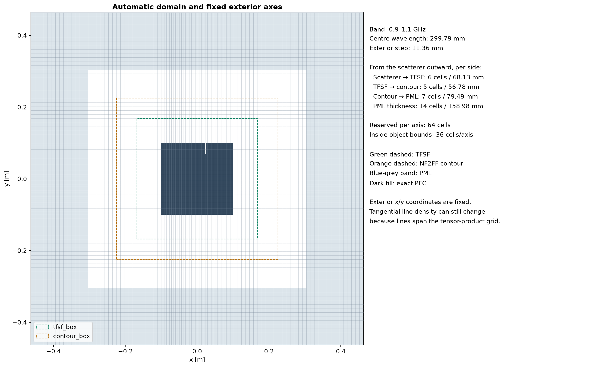
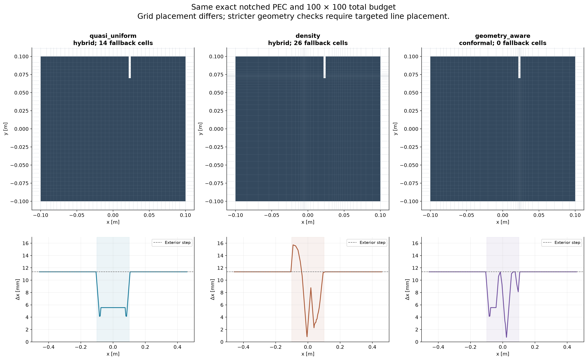
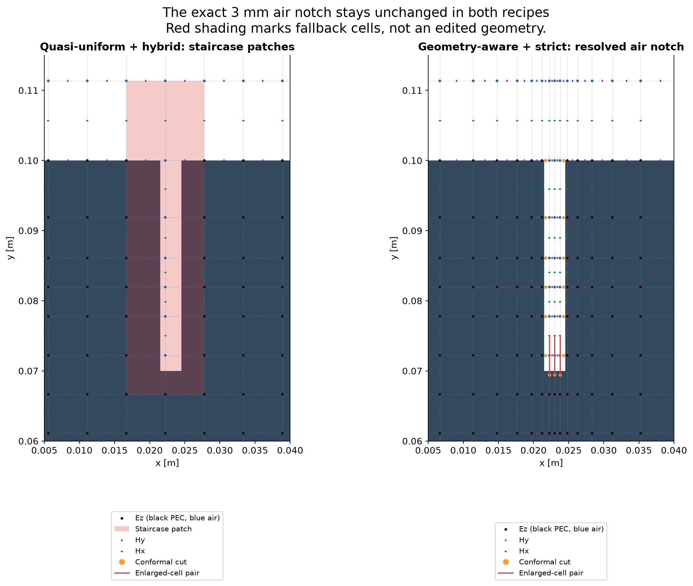

# Mesh strategies and boundary policies

FDTDMesh keeps three decisions separate: the **exact geometry**, the **grid-line
placement**, and the **boundary update on that grid**. Geometry is a continuous
PEC/air recipe; later shapes overwrite earlier material. Meshing never edits
that recipe. A tensor-product Yee grid supplies coordinates for the numerical
operator. The boundary policy then selects strict conformal enlarged-cell
updates or explicit local staircase fallback.

Preparation runs on the CPU. `sim.solve()` runs field updates, current DFTs and
NF2FF on native CUDA. None of the illustrations below requires a time-domain solve.

## Choose a grid strategy

| `apply_mesh` strategy | How lines are placed | Typical use | Main limitation |
|---|---|---|---|
| `uniform` | Exactly constant spacing on each axis. | A compatible regular-grid baseline. | Fixed exterior spacing and required anchors must coincide with that grid. |
| `quasi_uniform` | Constant-density targets projected onto layout, spacing and anchor constraints. | A simple baseline at an exact budget. | It does not repair unsupported cut topology. |
| `density` | Equal-density-mass targets, followed by constrained projection. | Prescribed refinement or an optimizer-generated density. | High density alone does not ensure valid conformal cuts or donors. |
| `geometry_aware` | Projected grids inspected against exact material; add repair anchors and retry. | The default strict-conformal starting mesh. | A small budget or construction limits can prevent a valid mesh. |
| `custom` | Use supplied axis coordinates without redistribution. | Replay, reference subdivision or externally generated grids. | The caller supplies compatible coordinates; solver preparation can reject them. |

The default call is `sim.apply_mesh("geometry_aware")`. `hybrid` is a
`BoundaryPolicy` mode, not another grid-placement strategy. There is currently
no public `cnn` mesh strategy or trained checkpoint loader.

## Domain spacing and the usable budget

The final PEC bounding box determines the domain. An air cutter's unused extent
does not enlarge it. Define the centre and shortest in-band wavelengths as

\[
\lambda_0 = \frac{c_0}{(f_{\min}+f_{\max})/2},
\qquad \lambda_{\min}=\frac{c_0}{f_{\max}}.
\]

`DomainPolicy` requests physical gaps as fractions of \(\lambda_0\). Exterior
resolution is a separate control, normally \(h_\mathrm{ext}=\lambda_\min/24\).

| Region, per side | Requested length | Minimum cells |
|---|---:|---:|
| Final PEC bound → TFSF | `(5/24) * λ0` | 3 |
| TFSF → NF2FF contour | `(4/24) * λ0` | 2 |
| Contour → inner PML edge | `(6/24) * λ0` | 2 |
| PML thickness | `0.5 * λ0` | `min_pml_cells`, default 12 |

An explicit `exterior_max_spacing` replaces the `exterior_ppw` target. The common
exterior step is reduced further if needed to meet the minimum counts. Each gap
is rounded outward to a whole number of steps: \(n_k=\lceil d_k/h_\mathrm{ext}\rceil\),
subject to its minimum. Thus achieved lengths can exceed requested lengths.
Changing the interior budget does not change this allocation.



For this 0.9–1.1 GHz example the per-side allocation is **6, 5, 7 and 14 cells**,
from scatterer to outer boundary. These are not the old fixed 5/4/6/12 counts:
wavelength-based lengths and outward rounding determine the counts now.
With `cells=(100, 100)`, the number of intervals across the object's bounding box
is only \(100-2(6+5+7+14)=36\) on each axis. Those intervals span both PEC and air;
they are not 36 freely movable coordinates because additional anchors constrain them.

Generated strategies preserve the fixed exterior axis coordinates, including
the scatterer-to-TFSF margins. This does **not** make every exterior 2D cell
identical: interior x-lines continue through the top/bottom exterior, and
interior y-lines continue through the left/right exterior. Tangential spacing
there can change. Use the same exact geometry, band and `DomainPolicy` for a
controlled mesh comparison.

For sharp tips on the bounding box, use `DomainPolicy(margin_mesh="graded")`.
The margin distances and counts remain fixed, but intermediate margin lines
inside TFSF may move. This removes the immediate fixed-width constraint beside
the tip while retaining grading and geometric clearance checks. Exterior lines
from TFSF through contour and PML remain fixed. The default is still `"fixed"`.

## Common preparation API

```python
from fdtdmesh import Simulation

sim = Simulation(fmin=0.9e9, fmax=1.1e9)
sim.add_rectangle((-0.1, 0.1), (-0.1, 0.1), material="PEC")
sim.add_rectangle((0.0215, 0.0245), (0.07, 0.2), material="air")
mesh = sim.apply_mesh("geometry_aware", cells=(100, 100))
sim.plot_geometry(mesh=True, figsize=(16, 14))
sim.plot_discretization(figsize=(16, 14))
```

| Argument | Default | Meaning |
|---|---|---|
| `strategy` | `"geometry_aware"` | One of the five strategies above. |
| `cells` | `None` | Exact total `(Nx, Ny)`, including all margins and PML. Required for uniform, quasi-uniform and density. |
| `target_spacing` | `None` | Geometry-aware spacing target in metres; omitted uses `C0 / fmax / 32`. Available only when `cells` is omitted. |
| `max_cells` | `(512, 512)` | Per-axis cap for geometry-aware automatic counts; not a budget request. |
| `density` | `None` | Two positive 1D bin arrays, for `density` only. |
| `mesh` | `None` | An existing `Mesh`, for `custom` only. |
| `options` | `None` | `MeshOptions` for generated strategies. |

Explicit `cells` cannot be combined with `target_spacing` or a nondefault
`max_cells`. `custom` accepts only `mesh=`. A failed preparation leaves an
already applied mesh intact. Editing geometry invalidates the applied mesh.

## Uniform and quasi-uniform

`uniform` starts with \(x_i=iL_x/N_x\) and \(y_j=jL_y/N_y\). It checks that
PML collars, fixed exterior lines, source/phase anchors and TFSF/contour lines
coincide with this grid. A mathematically uniform grid at an arbitrary budget
will usually miss at least one required coordinate. The strategy rejects that
request rather than moving the layout. Exact geometry must also pass the
selected boundary policy.

`quasi_uniform` starts with constant density within each interval between
fixed-index coordinates. A constrained projection moves free lines to satisfy
anchors and grading. It is uniform where possible, with transitions near
constraints. It is useful when the exact requested budget is more important
than globally equal cell widths.

```python
# Alternatives on an already defined simulation; either may fail under strict cuts.
sim.apply_mesh("uniform", cells=(100, 100))
sim.apply_mesh("quasi_uniform", cells=(100, 100))
```

These are alternative requests, not a claim that this example supports an
exactly uniform 100 × 100 grid. Quasi-uniform construction does not automatically
place lines at every corner or detect and repair hidden thin features.

## Density-based placement and projection

`density=(rho_x, rho_y)` supplies finite, strictly positive values on equal-width
bins over the **whole resolved solver domain**. Each array can have a different
length. More density requests more grid lines locally; multiplying an entire
array by a positive constant has no effect on its ideal quantiles.

Between two coordinates fixed at indices \(i_a,i_b\), let \(n=i_b-i_a\). Ideal
line targets \(\hat x_j\) divide density mass equally:

\[
\int_a^{\hat x_j}\rho_x(s)\,ds
=\frac{j}{n}\int_a^b\rho_x(s)\,ds,\qquad j=0,\ldots,n.
\]

This integration is performed separately in each fixed-index interval. Density
inside fixed exterior cells cannot pull lines out of those cells. The projector
then minimizes normalized line displacement,

\[
\min_x\sum_{i=1}^{N_x-1}|x_i-\hat x_i|/L_x,
\]

subject to fixed coordinates, ordered anchors, spacing bounds and adjacent-cell
grading. For widths \(h_i=x_{i+1}-x_i\), the grading constraint is
\(1/r\le h_{i+1}/h_i\le r\), with \(r\le1.4\). Assigning anchors to line
indices can require mixed-integer optimization. This projection optimizes
agreement with the proposed density, **not electromagnetic scattering error**.

```python
import numpy as np

u = (np.arange(128) + 0.5) / 128
rho_x = 1 + 5 * np.exp(-((u - 0.53) / 0.045)**2)
rho_y = 1 + 3 * np.exp(-((u - 0.60) / 0.045)**2)
sim.apply_mesh("density", cells=(100, 100), density=(rho_x, rho_y))
```

Here `u` measures a fraction of the full domain, not of the object bounding box.
To centre a density peak on an input geometry coordinate `x`, use
`(x + sim.coordinate_offset[0]) / sim.size[0]`. A projected density mesh still
undergoes operator validation and may be rejected in strict mode.



All panels use the same exact 0.2 m square with a 3 mm air notch, the same domain
and 100 × 100 total budget. Quasi-uniform and density meshes use hybrid mode so
unsupported cuts can be displayed; the geometry-aware mesh uses strict mode.
The preparation produced **14, 26 and 0 fallback cells**, respectively. The
chosen density concentrates lines but also coarsens other regions; it does not
target the exact notch topology. These are illustrative choices, not optimized
densities or a scattering-accuracy ranking. The shaded x-range in the lower row
is the object bounding interval; exterior step sizes remain fixed.

## Geometry-aware construction

`geometry_aware` uses the continuous final material, including air overlays,
to repair the grid before any FDTD run:

1. Reserve the exterior cells. Use the exact requested counts, or initialize
   interior counts from object spans divided by the target spacing.
2. Seed feature probes from primitive centres, including air cutters, and build
   a projected constant-density mesh with the required layout coordinates.
3. Intersect Yee edges with exact material intervals. Detect multiple crossings,
   PEC between two air endpoints, air between two PEC endpoints, and unresolved
   features enclosed by a cell. Check small cut faces for available donors.
4. Propose witness coordinates inside missing material intervals or donor air
   intervals. Add those coordinates as anchors and project again. Witnesses
   resolve local material/topology; they need not lie on every exact corner.
5. Validate the actual conformal enlarged-cell operator. Return only a mesh
   accepted by the selected boundary policy and the remaining solver checks.

The loop first tries local anchor-index assignments, then a joint assignment if
projection is infeasible. In automatic-count mode it can increase interior counts
(at least four cells or about 20% per growth step), bounded by `max_cells`, time
and pass limits. It can discard a conflicting latest repair before refinement.
**Exact-budget mode never increases the budget**; it fails when these bounded
repairs cannot produce an accepted allocation. Failure is not a proof that no
valid grid exists at that budget.

```python
from fdtdmesh import MeshOptions

# Exact budget: accepted at exactly these counts, or an exception.
sim.apply_mesh("geometry_aware", cells=(100, 100),
               options=MeshOptions(time_limit=30, max_passes=20))

# Alternative: spacing-guided counts, allowed to grow within caps.
sim.apply_mesh("geometry_aware", target_spacing=sim.wavelength / 64,
               max_cells=(256, 256))
```

The default geometry-aware maximum spacing is
`max(exterior_spacing, target_spacing)` (use `1.4 * exterior_spacing` for the
first term with graded margins); a supplied `AxisConstraints` replaces
that default. A target is therefore not a guarantee that every interior cell
has that exact size. In exact-budget mode the default spacing constraint still
matters: even a positive count after reserving margins may be insufficient.

With `BoundaryPolicy(mode="hybrid")`, the builder first records an accepted
hybrid proposal, then tries up to `MeshOptions.hybrid_repair_passes` additional
inspected proposals (default three). It retains the proposal with the smallest
maximum physical patch diameter, then smallest area as a tie-break. Repeated
non-improvement or unchanged repair witnesses ends the loop. If projection/time
limits prevent more repairs, an already accepted mesh is retained. Zero fallback
ends construction immediately. This bounded process does not declare a tip
mathematically impossible; it avoids spending the entire budget on persistent
local topology. The selected mesh retains its own witnesses and issue report.

Choose strict mode when every cut must be conformal. In optimization, hybrid is
the default and the score is far-field error against a qualified reference, not
patch count. [Notebook 05](../notebooks/05_hybrid_tip_optimization.ipynb) exercises
this distinction with an irregular tip and a seven-point star.

## Custom coordinates

`sim.apply_mesh("custom", mesh=existing_mesh)` preserves the supplied x/y
coordinates. Axes are in metres in the translated solver frame: each starts at
zero and must match the resolved domain. Geometry plots translate them back to
input coordinates. Reusing `sim.mesh` in another simulation is simplest when
geometry, band and domain policy are identical.

`Mesh` enforces finite, increasing axes and the mandatory grading limit. Solver
preparation validates PML collars, layout/source anchors, clearances and the
boundary operator. It does not redistribute custom lines through the generated
mesh projector. For controlled comparisons, the caller must also preserve the
same exterior axis coordinates; passing solver preparation alone is not an
assertion that every custom exterior line matches a generated baseline.

## Strict conformal and hybrid boundary updates

Strict mode is the default:

```python
from fdtdmesh import BoundaryPolicy, Simulation

strict = Simulation(fmin=0.9e9, fmax=1.1e9,
                    boundary=BoundaryPolicy(mode="conformal"))
hybrid = Simulation(fmin=0.9e9, fmax=1.1e9,
                    boundary=BoundaryPolicy(mode="hybrid",
                                            max_fallback_fraction=0.01))
```

Strict conformal uses exact open-air lengths on supported edges. A small open
length below half the full edge requires a compatible adjacent full-air donor
for an enlarged-cell pair. Donors must have sufficient length and cannot be
shared by multiple pairs. Thin gaps, thin PEC strips and sharp tips can violate
either the local cut topology or donor requirements; strict mode rejects them.

Hybrid marks unsupported cells and makes their shared edges use a staircase
rule: an edge with two PEC endpoints has zero open length; otherwise it has the
full edge length. Supported regions retain conformal enlarged-cell updates.
Fallback edges cannot donate to nearby conformal pairs. If this invalidates a
neighbouring donor, the patch expands and donor assignments are rebuilt until
consistent. Thus the final patch can exceed the initially problematic voxel.
The timestep bound is computed from the resulting mixed operator.



Black/blue dots are PEC/air Ez nodes, green marks are Hx, and purple marks are Hy.
Orange marks show conformal cuts and red segments join enlarged-cell pairs.
Red shading identifies staircase patches. The white notch shows the unchanged
exact geometry; the hybrid numerical representation can lose or broaden thin
features despite retaining their exact recipe. This is why a successful hybrid
preparation does not establish scattering accuracy.

| `BoundaryPolicy` field | Default | Meaning |
|---|---|---|
| `mode` | `"conformal"` | Strict conformal or `"hybrid"`. |
| `max_fallback_fraction` | `1.0` | Maximum fallback area divided by **total domain area**, including PML. |
| `on_fallback` | `"warn"` | Emit `StaircaseFallbackWarning`; `"error"` rejects any fallback. |
| `max_patch_diameter` | `None` | Optional physical cap in metres on each connected patch's bounding-box diagonal. |

The area fraction is not an error estimate. A tiny patch at an important gap can
matter disproportionately. Inspect the patch locations as well as the count.
See [the numerical method](numerical_method.md) for the operator and
[validation](validation.md) for the bounded accuracy screen and its limitations.

## Advanced controls and failure diagnosis

| `MeshOptions` field | Default | Scope |
|---|---|---|
| `constraints` | `None` | Optional `AxisConstraints` for generated meshes. |
| `anchors` | `None` | `(x_coordinates, y_coordinates)` in solver-frame metres; geometry-aware selects its own witnesses and rejects overrides. |
| `anchor_assignment` | `"local"` | Local, joint or fixed anchor-index assignment for projected strategies; geometry-aware manages its own retries. |
| `time_limit` | `30.0` s | Construction resource limit; geometry-aware checks elapsed time between passes and passes remaining time to projectors. |
| `max_passes` | `20` | Geometry-aware repair-pass cap. |
| `hybrid_repair_passes` | `3` | Additional inspected hybrid repair proposals; `0` accepts the first policy-valid proposal. |

| `AxisConstraints` field | Default | Meaning |
|---|---|---|
| `min_spacing` | `0.0` m | Lower cell-width bound; widths must still be strictly positive. |
| `max_spacing` | `None` | Optional upper width bound; must accommodate fixed exterior cells. |
| `max_ratio` | `1.4` | Maximum adjacent-width ratio in either direction; permitted range `[1, 1.4]`. |

`local` restricts anchor assignment to nearby line indices, `joint` searches all
permitted ordered indices, and `fixed` preassigns indices by position. More joint
freedom can cost construction time. An anchor is a full x- or y-line in this
tensor-product grid, so adding many corner anchors can quickly consume a budget.

Inspect `sim.summary()` for reserved/interior counts and minimum widths.
`mesh.metadata["geometry_aware"]` contains pass history, witness anchors and
validation status. `sim.discretization.boundary_report` contains fallback
indices, reasons, initial/expanded counts, area fraction and enlarged-pair count.
It also reports `fallback_area_m2`, `fallback_max_diameter_m`, and `patches`
with four-neighbour connected cell counts, areas, bounds and bounding-box
diameters. A small patch can still close a thin gap or affect connectivity; these
metrics are diagnostics and optional geometric limits, not accuracy guarantees.

| Failure | Interpretation and next step |
|---|---|
| `MeshInfeasibleError` | Requested budget/anchors/spacing/layout could not be satisfied. Inspect reserved counts and constraint conflicts. |
| `GeometryMeshingError` | Geometry-aware bounded construction failed; inspect `.report` for passes and unresolved issues. Consider a larger budget or different constraints. |
| `MeshOptimizationError` | Projection did not complete within its limits. Distinguish a timeout from proven projection infeasibility. |
| `UnresolvedGeometryError` | Unsupported strict topology/donors or a rejected hybrid fallback. Inspect the local geometry and policy limits. |

Geometry-aware construction finds an accepted starting mesh; it does not
minimize far-field error. [Mesh optimization](mesh_optimization.md) searches line
placement against a qualified reference, with `feasible_local` or
`differential_evolution` selected separately from `apply_mesh`. Its adaptivity
analysis estimates remaining movement under the current constraints. A valid
mesh, temporal DFT convergence, and a spatially qualified result are different
checks.

## Reproduce the illustrations

Run `python scripts/plot_mesh_strategies.py` from the repository root. The script
uses the public preparation API and Matplotlib, saves the three PNGs and a
[preparation summary](assets/mesh_strategy_figures.json) under `docs/assets`, and
performs no FDTD solves or optimization campaign. Generated axes and fallback
counts are measurements of these preparations, not accuracy results.

For executable workflows see [notebook 01](../notebooks/01_geometry_and_mesh.ipynb),
[notebook 03](../notebooks/03_hybrid_boundary.ipynb), and the
[solver API tables](solver_api.md).
