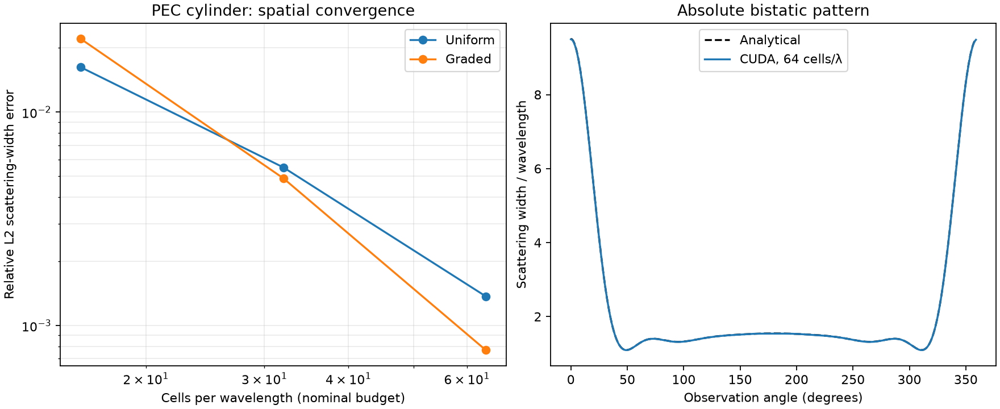

# Laptop qualification, 2026-09-27

Reproduce with `python benchmarks/validate_scattering.py` after the native build.
Machine: RTX 4070 Laptop GPU, 8188 MiB; Windows, Python 3.12, CUDA 13.3.
Full measured diagnostics and acceptance gates are in
[validation_results.json](validation_results.json). Raw arrays are regenerated
under `artifacts/qualification/`. No training labels were produced.

## Analytical cylinder

Radius 0.47 wavelengths, domain 6 × 6 wavelengths, 1 GHz, +x incidence,
360 angular samples, float64. Errors are relative L2 norms over the complete
absolute angular pattern. The graded cases have the same tensor-product cell
budgets, using the demonstration Gaussian density and fixed physical collars.

| Nominal cells/λ | Uniform width error | Graded width error | Uniform complex-amplitude error | Graded complex-amplitude error |
|---|---:|---:|---:|---:|
| 16 | 1.623% | 2.204% | 3.827% | 6.583% |
| 32 | 0.551% | 0.490% | 0.905% | 1.595% |
| 64 | 0.137% | 0.077% | 0.226% | 0.386% |

These results establish convergence for the tested conformal/ECT cases. They do
not show a general advantage for graded meshes: phase accuracy, smaller dt,
update count and meshing cost also matter. At 64, the uniform and graded runs
used 3,840 and 5,376 updates respectively. The uniform GPU run took about 285 ms
and allocated 14.6 MB. Timings are individual laptop measurements, not a controlled
performance benchmark. Density projection can dominate total runtime.

## Independent sensitivity controls

At the 64-cell/λ uniform cylinder baseline:

| Control | Relative width change or stated metric |
|---|---:|
| Move contour inward by 0.125 λ on each side | 0.0703% |
| Refine PML 32→40 cells, same interior and same dt | 0.0554% |
| Reduce baseline dt by 20% | 0.00572% |
| Tighten DFT tolerance and require six stable checks, 3,840→4,608 steps | 1.05e-10 relative |
| float32 versus float64 fields, float64 DFTs | 1.10e-7 relative |
| Incident complex field versus continuum plane wave inside TFSF | 0.131% |
| Translate cylinder by (0.013, 0.019) λ: analytical width error | 0.134% |
| Change radius to 0.433 λ: analytical width error | 0.127% |
| Empty graded domain: maximum absolute amplitude | 3.04e-15 |

The PML control preserves every interior grid line, increases the total budget
to 400 × 400, and compares against a baseline run at the same reduced timestep.
It therefore avoids confusing interior mesh changes with PML sensitivity.
The translated complex reference includes the incident and observation phase shifts.

## Interacting and non-smooth shapes

| Shape | Width change, 16→32 | Width change, 32→64 |
|---|---:|---:|
| Rectangle | 5.455% | 1.888% |
| Two separated cylinders | 0.767% | 0.273% |
| Slotted PEC body | 0.980% | 0.381% |

These are consecutive-refinement differences, not errors against an exact
solution. All decrease and pass the foundation's 3% final-difference gate.
The rectangle is **not** qualified as a sub-percent training reference; further
refinement is required for that purpose. This distinction must carry into Stage 3.
The same caution applies to new corners, narrow gaps and high-Q resonators.

## Regression and memory checks

The complete suite reports **38 passed**, with no skips on this laptop.

The test suite covers exact-budget meshes and grading, exact cut intersections,
PEC walls around vacuum overlays, unsupported topology rejection, pair circulation
conservation, positive-definite enlarged operators, and the lossless spectral bound.

Native tests compare both field precisions against NumPy on uniform and graded
meshes, using nonzero initial fields and staggered online DFTs. They compare GPU
NF2FF against a separate CPU integral at 0.9, 1.0 and 1.1 GHz; check cylinder
refinement and empty scattering; enforce the source guard, consecutive checks and
exact safety cap; check buffer validation and normal-run transfer counts; and use
a slow callback to verify that GPU execution continues independently.

A lossless tiny-cut case remains bounded for 20,003 updates with dt above half
the Cartesian limit. This supports the operator analysis; it does not replace
geometry-specific validation of arbitrary configurations.

CUDA Compute Sanitizer 13.3 `memcheck --error-exitcode 99` on the native parity
and malformed-buffer tests completed with **ERROR SUMMARY: 0 errors**.
The report is in the local `artifacts/compute_sanitizer.log`.
No current or field array is transferred during stepping. A normal single-bin,
360-angle run downloads 8,640 bytes of final amplitude/width arrays, plus small
diagnostics. Explicit validation downloads are reported separately.

## Remaining qualification limits

Only +x TMz incidence and the documented cut topology are supported. Arbitrary
rotated polygons can require explicit geometry anchors; invalid edge connectivity
or an unavailable donor is an error, not an approximate fallback. The stopping
policy detects settling and residual fields but does not prove an infinite-tail
bound for every resonance. The Linux/server build and cross-device agreement
remain to be checked before server-scale generation.
