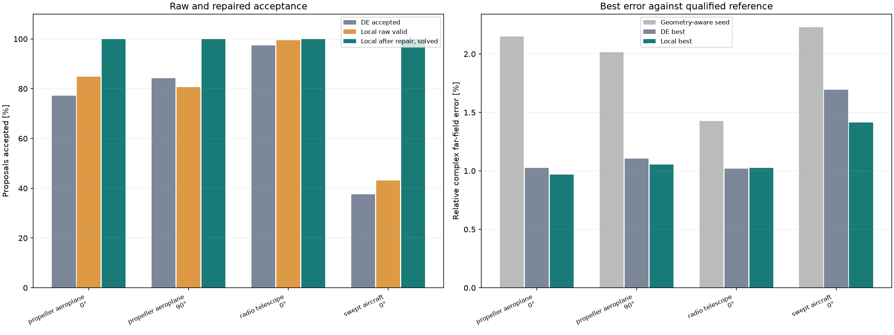
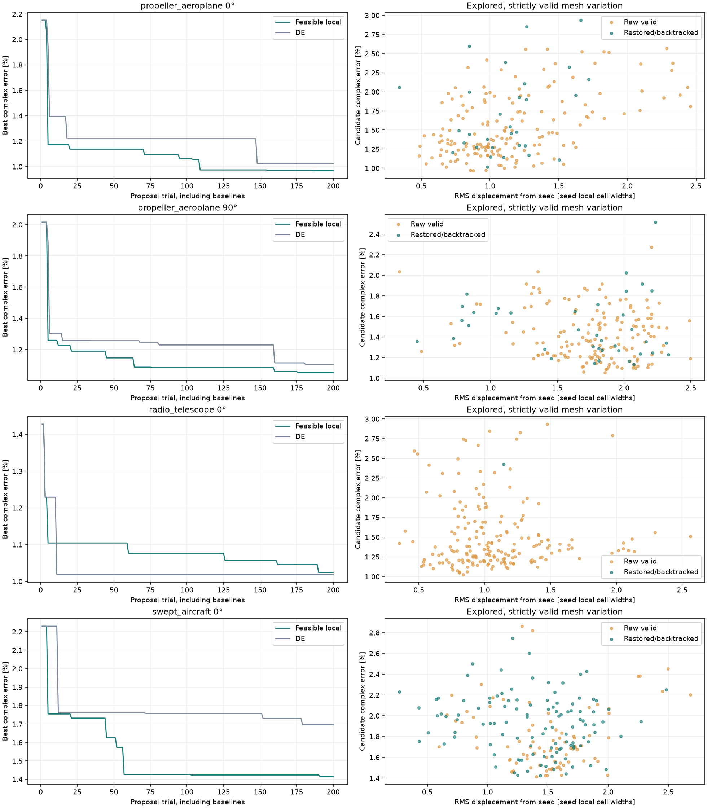
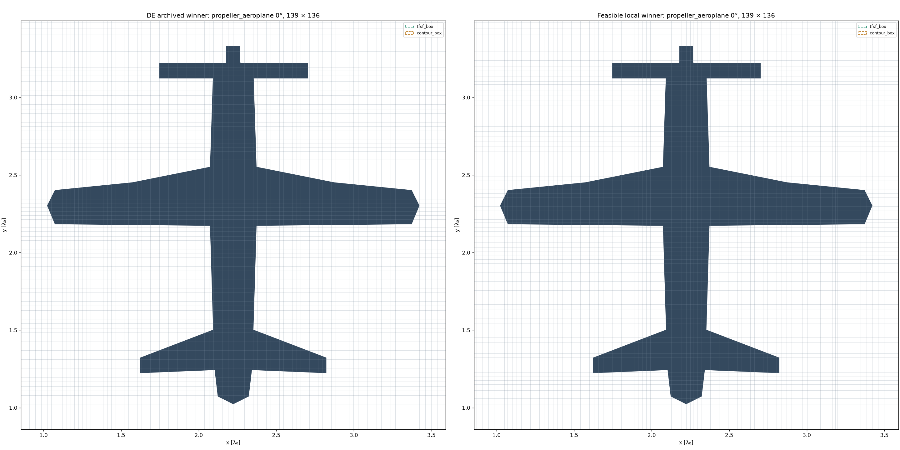
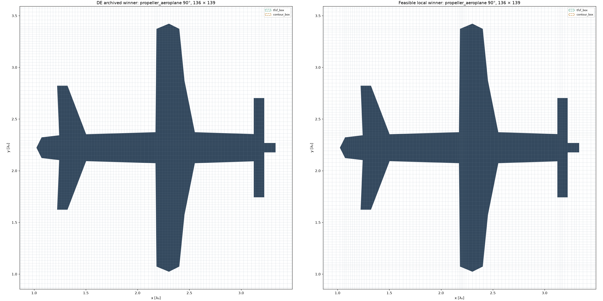
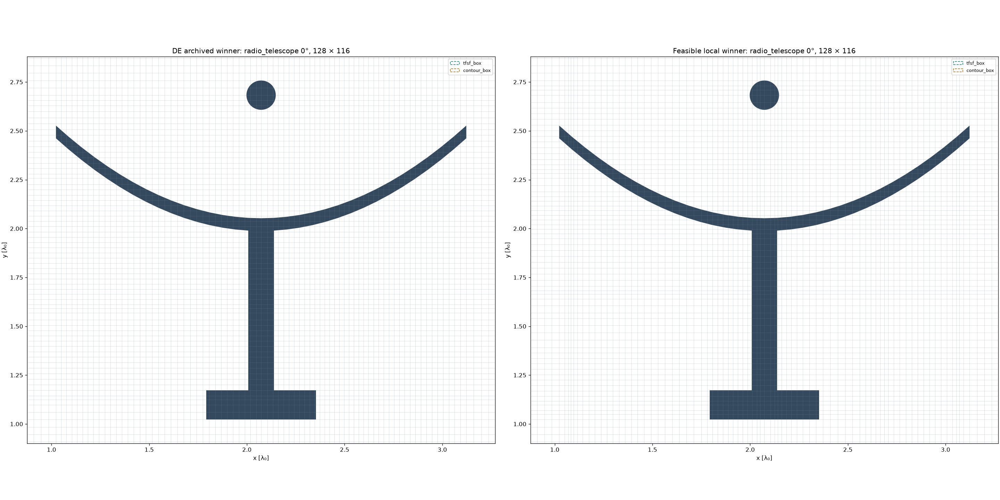
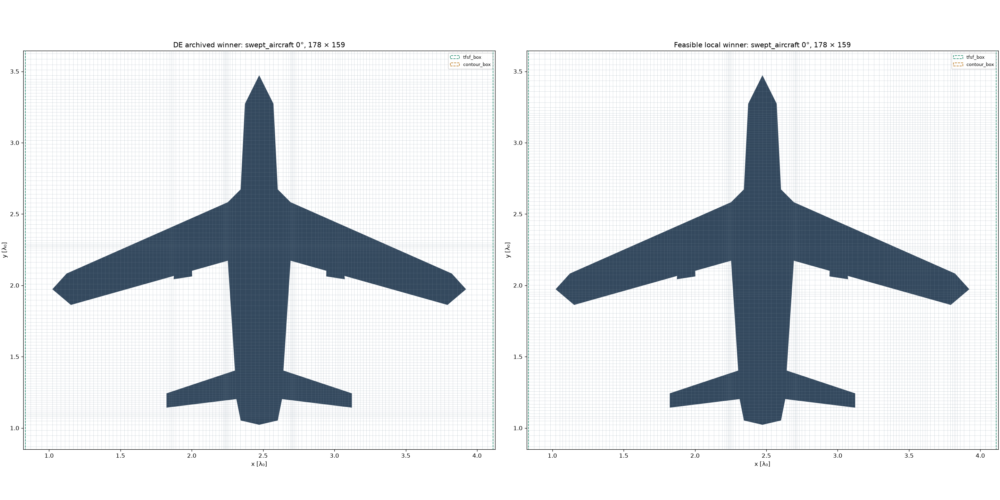

# Feasible local mesh optimization: measured comparison

This experiment tests whether seed-relative proposals and geometric restoration
improve acceptance without collapsing the search into nearly identical meshes.
The physical problem remains exact-geometry, 2D TMz PEC scattering with native
CUDA conformal FDTD, enlarged-cell updates, broadband DFT and GPU NF2FF.
See the [original study](geometry_aware_optimization_study.md) for the numerical
background, exact geometry construction, thin-feature challenges and CNN proposal.

## Algorithm and constraints

`strategy="feasible_local"` starts from an accepted geometry-aware seed. Its
witness coordinates AND their line indices remain fixed, as do exterior/margin
coordinates. Smooth, local and single-axis displacement proposals are projected
onto linear spacing/ratio constraints at exactly the original axis counts.
Proposal radii use the seed's local dual widths, making their scale consistent
as the parent mesh changes. The retained pool combines low-error and displaced
parents; default exploration probability is 0.3.

Every candidate is inspected against exact CSG scanline intersections and the
strict enlarged-cell operator. Failed edge regions can be restored to a valid
parent's coordinates while other changes remain. These restoration constraints
are temporary. Further backtracking tests smaller endpoints, with no assumption
that feasibility is monotone along a segment. A minimum maximum displacement of
0.03 seed-cell widths filters negligible proposals, and exact duplicates are
excluded from local solves. Repairs move grid lines while preserving exact
geometry and enlarged-cell equations. This version keeps anchor indices fixed;
it does not certify a global optimum. Radius adjustment responds to feasibility,
while the retained parent pool uses objective values and geometric diversity.
It is not a formal trust-region stationarity test. Movable interior tensor-grid
lines still extend tangentially through the exterior; the preserved quantities
are the exterior axis coordinates.

## Comparison protocol

Each local search uses the recorded proposal allowance and RNG seed (defaults:
200 trials, including three baselines, and seed 0), six interpolation controls
and a 12-parent pool. It uses
the exact archived geometry-aware seed and cell budget of its corresponding DE
study. Both methods retain the same three comparison baselines; those baselines
can have other anchor-index assignments, while local-search proposals stay in
the seed's allocation. Best-error curves include the baselines. Numerical
references are requalified under the current implementation.
Unless `--rerun-de` was used, DE is a historical comparison: every archived
feasible field is rescored against the current reference, not relabelled as a
new run or reused as a matching solver cache. A new optimizer has more internal
geometry checks and often more GPU solves for the same proposal budget; this
is not an equal-wall-time or equal-solve-budget performance comparison.
Every mesh retains its own native CFL time step. Fixed cell counts therefore
do not imply identical time steps or update counts. The winner check tightens
DFT/field stopping tolerances; it is a truncation-convergence check, not an
independent time-step-refinement study.

Raw acceptance counts proposals valid before restoration. Final acceptance
counts unique proposals that also completed the FDTD convergence criterion.
Internal check counts include projection failures and negligible candidates.
More acceptance alone does not prove a lower achievable field error.

| Shape / incidence | Cells | DE accepted | Local raw valid | Local solved after repair | Seed error | DE best | Local best |
|---|---|---:|---:|---:|---:|---:|---:|
| propeller_aeroplane / 0° | 139 × 136 | 152/197 | 167/197 | 197/197 | 2.151% | 1.024% | 0.969% |
| propeller_aeroplane / 90° | 136 × 139 | 166/197 | 159/197 | 197/197 | 2.015% | 1.106% | 1.053% |
| radio_telescope / 0° | 128 × 116 | 192/197 | 196/197 | 197/197 | 1.428% | 1.018% | 1.024% |
| swept_aircraft / 0° | 178 × 159 | 74/197 | 85/197 | 197/197 | 2.230% | 1.695% | 1.415% |

### Findings and experiment cutoff

The four completed comparisons contain 788 local-search proposals, each producing
a distinct mesh that passed strict geometry/enlarged-cell checks and the FDTD
stopping criterion. Historical DE accepted 584 of 788 proposals (74.1%). The local
method accepted 607 of 788 before restoration (77.0%) and all 788 after restoration
or backtracking. This is measured acceptance for these cases, not a guarantee for
new geometries.

The largest accuracy improvement was the swept aircraft at 0°: relative complex
far-field error decreased from 1.695% to 1.415%. Both propeller cases also improved.
The telescope results were comparable: 1.018% versus 1.024%, a difference smaller
than the observed numerical-reference discrepancy. Median accepted moves ranged
from 0.655 to 0.717 seed local cell widths, with 61–100 moved lines. Thus these
searches retained substantial variation rather than achieving acceptance through
negligible changes. All four winners passed the tighter stopping-tolerance check.

The experiment was stopped at the user's request once this evidence was available.
The partially completed telescope 90° optimization and unstarted aircraft 90°
comparison are excluded from the completed-case tables and conclusions. Cached
partial work remains available for a future explicit continuation. No further
simulation is needed to reproduce this report from the saved results.

### Equal accepted-search prefixes

These post-hoc prefixes include the same number of accepted search evaluations for each method, with their preceding baselines. Cache hits count as accepted evaluations. They do not equate CPU repair work or GPU runtime.

| Case | Accepted search evaluations | DE best | Local best |
|---|---:|---:|---:|
| propeller_aeroplane / 0° | 152 | 1.024% | 0.972% |
| propeller_aeroplane / 90° | 166 | 1.106% | 1.060% |
| radio_telescope / 0° | 192 | 1.018% | 1.024% |
| swept_aircraft / 0° | 74 | 1.695% | 1.427% |

## Mesh variation and validation

| Shape / incidence | Unique local solves | Internal candidate checks | Median parent RMS move | Median seed RMS move | Median moved lines | Search seconds | Winner temporal check |
|---|---:|---:|---:|---:|---:|---:|---|
| propeller_aeroplane / 0° | 197 | 228 | 0.717 cells | 1.073 cells | 78 | 263.1 | True |
| propeller_aeroplane / 90° | 197 | 235 | 0.668 cells | 1.815 cells | 77 | 269.1 | True |
| radio_telescope / 0° | 197 | 198 | 0.679 cells | 1.015 cells | 61 | 553.1 | True |
| swept_aircraft / 0° | 197 | 350 | 0.655 cells | 1.495 cells | 100 | 337.5 | True |

RMS displacement is measured over the seed's nonfixed coordinates and normalized by seed local dual cell widths. The seed RMS column measures cumulative departure, while parent RMS measures each accepted move.

The largest current-versus-previous reference field difference is 0 relative L2. Observed reference discrepancies and all archive paths are retained in [the numerical data](feasible_optimizer_results.json). Small differences between optimizer winners must be interpreted relative to those discrepancies.

## Best meshes

## Adaptivity diagnostics and remaining scope

`analyze_mesh_adaptivity(sim, seed)` returns LP minimum/maximum coordinates under
fixed witness indices, spacing and grading. These are conditional upper bounds:
they omit geometry/donor constraints and their coordinate extremes cannot all be
attained simultaneously. Per-case `adaptivity.json` files store the full arrays.
Neither free-line counts nor acceptance percentages certify the minimum viable
cell budget. A budget sweep and an outer discrete anchor-index allocation search
remain separate future experiments. Solver-time-aware or equal-solve comparisons
and multiple random seeds are also needed before general performance claims.

The same feasibility layer could accept residual mesh proposals from a CNN.
Training targets should retain exact geometry, incidence/frequency conditions,
budget, seed, validation outcome and actual displacement—not only density curves.
This first implementation provides feasible examples; it does not demonstrate a
learned optimizer or establish globally optimal labels.

| Case | Free lines x / y | LP-mobile lines x / y | Median LP range x / y (seed cell widths) |
|---|---:|---:|---:|
| propeller_aeroplane / 0° | 83 / 78 | 83 / 78 | 12.13 / 10.35 |
| propeller_aeroplane / 90° | 77 / 83 | 77 / 83 | 9.68 / 12.13 |
| radio_telescope / 0° | 72 / 57 | 72 / 57 | 10.23 / 4.58 |
| swept_aircraft / 0° | 112 / 102 | 112 / 102 | 4.32 / 18.54 |

These LP ranges describe available coordinate movement under the linear constraints only. Actual accepted displacement above provides complementary empirical evidence after exact geometry validation.

## Reproduction

Run `python examples/geometry_optimization_study/feasible_comparison.py` from the
repository root with the archived engineered study present; `--rerun-de` performs
a new DE search too. Then run
`python examples/geometry_optimization_study/build_feasible_report.py`.
Notebook 04 provides an opt-in API example independent of these archived cases.
See [API argument tables](../docs/mesh_optimization_api.md) for all settings.

## Additional oblique geometry-only checks

Each case generated 24 proposals from its unchanged valid seed at radius 0.75 local cell widths, RNG seed 123. These check exact topology and enlarged-cell construction only: no FDTD solves, objective optimization or scattering-accuracy claims are included.

| Case | Cells | Raw valid | Valid after restoration | Unique valid | Median RMS movement |
|---|---|---:|---:|---:|---:|
| swept_aircraft / 45° | 173 × 173 | 2/24 | 24/24 | 24 | 0.255 cells |
| propeller_aeroplane / 15° | 426 × 413 | 2/24 | 19/24 | 19 | 0.220 cells |
| radio_telescope / 30° | 173 × 176 | 4/24 | 24/24 | 24 | 0.259 cells |

Reproduce with `python examples/geometry_optimization_study/feasible_geometry_screen.py`.
